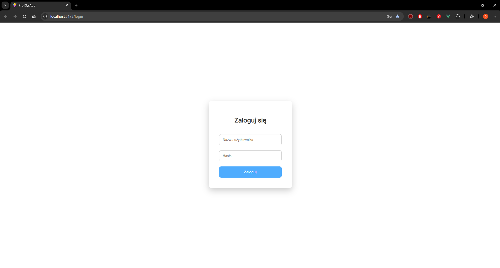
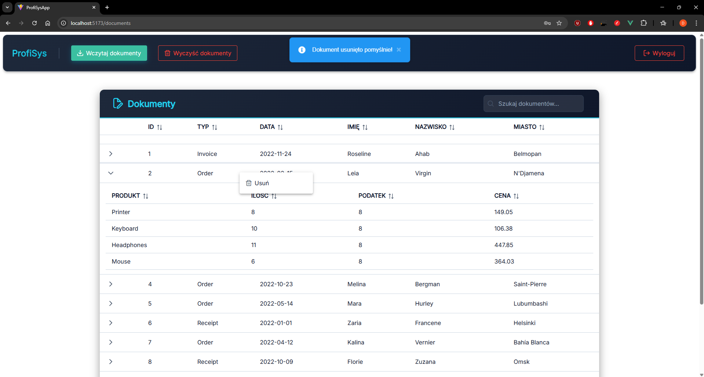

<h2 align="center"><strong>ProfisysApp – System zarządzania dokumentami</strong></h2>

<div align="center">
    <p>
      
      
    </p>
    <p>
      
      
      
      
      
      
      
      
      <br>
      
      
      
    </p>
</div>

---

## 🎯 Cel projektu

Celem aplikacji **ProfisysApp** jest stworzenie systemu do zarządzania dokumentami, który umożliwia:

- Przechowywanie dokumentów w bazie danych i zarządzanie nimi.
- Pobieranie, importowanie i usuwanie dokumentów z poziomu frontendu.
- Bezpieczny dostęp do danych poprzez autoryzację JWT.
- Interaktywny interfejs użytkownika z Vue 3.
- Powiadomienia o stanie operacji poprzez Toastification.

---

## 👤 Rola użytkownika

| Rola  | Uprawnienia |
|-------|--------------|
| Admin | Logowanie, pobieranie dokumentów, import CSV, usuwanie dokumentów. |
| User | Logowanie, przeglądanie dokumentów. |

---

## 🔐 Przykładowe konta użytkowników

| Login  | Hasło | Rola |
|-------|--------|-----|
| admin | admin | Admin |
| user | user | User |

---

## 🧱 Stack technologiczny

### Backend:
- **ASP.NET Core 8** – API REST do zarządzania dokumentami.
- **C#** – logika biznesowa.
- **SQLite** – baza danych dla użytkowników i dokumentów.
- **JWT Authentication** – bezpieczne uwierzytelnianie i autoryzacja użytkowników.

### Frontend:
- **Vue 3** – interaktywny frontend.
- **Pinia** – zarządzanie stanem aplikacji.
- **Axios** – komunikacja z backendem.
- **Toastification** – powiadomienia dla użytkownika.
- **Vite** – narzędzie do budowania i uruchamiania projektu frontendowego.
- **PrimeVue** – biblioteka komponentów UI dla Vue.js.

---

## 🧩 Moduły i funkcjonalności

| Moduł | Opis |
|-------|------|
| 🔐 **Logowanie** | Uwierzytelnianie użytkowników i przechowywanie tokenu JWT. |
| 📝 **Lista dokumentów** | Wyświetlanie wszystkich dokumentów w tabeli z wyszukiwaniem i możliwością sortowania. |
| 📂 **Import CSV** | Import danych z plików CSV do bazy danych. |
| 🗑 **Usuwanie dokumentów** | Usuwanie pojedynczych lub wszystkich dokumentów w bazie. |
| 📡 **Autoryzacja JWT** | Bezpieczny dostęp do endpointów API tylko dla zalogowanych użytkowników. |
| 💬 **Powiadomienia** | Toasty informujące o powodzeniu lub błędach operacji. |
| 🔄 **Routing** | Strony chronione i przekierowania na login w przypadku braku tokenu. |
| 📜 **Audit.log** | Śledzi aktywność użytkowników – kto, kiedy i jaką operację wykonał. |
| ⚠️ **Obsługa błędów** | Wyświetla powiadomienia o błędach operacji i informuje użytkownika o stanie akcji. |

---

## 📡 Endpointy API

| Metoda | Endpoint | Opis | Autoryzacja |
|---------|-----------|------|--------------|
| **POST** | `/api/auth/login` | Logowanie użytkownika i wygenerowanie tokenu JWT | ❌ |
| **POST** | `/api/auth/register` | Rejestracja nowego użytkownika. Niedostępne na frontend. | ❌ |
| **GET** | `/api/documents` | Pobranie wszystkich dokumentów z bazy danych | ✅ |
| **DELETE** | `/api/documents/{documentId}` | Usunięcie pojedynczego dokumentu po ID | ✅ |
| **DELETE** | `/api/documents` | Usunięcie wszystkich dokumentów z bazy | ✅ |
| **POST** | `/api/dataImport/csvFiles` | Import danych z plików CSV do bazy SQLite | ✅ |

✅ – wymaga tokenu JWT  
❌ – dostępny publicznie

---

## 📸 Zrzuty ekranu

| Widok | Podgląd |
|-------|----------|
| Strona logowania |  |
| Lista dokumentów |  |

---

## 🔧 Instrukcja uruchomienia

### Backend (./apps/server):
1. Skonfiguruj plik `appsettings.json` z danymi do bazy danych. Jeśli korzystasz z `SQLite` nie zmieniaj nic:
```env
{
  "ConnectionStrings": {
    "DefaultConnection": "Data Source=documents.db"
  }
}
```

2. W pliku konfiguracyjnym `./apps/server/Config/AppSettings.cs` w zmiennej `CLIENT_URL_ADDRESS` wpisz adres na, na którym pracuje twój Client:
```env
public string CLIENT_URL_ADDRESS { get; set; } = "http://localhost:5173";
```

3. Zainstaluj wszystkie zależności:
```env
dotnet restore
```

4. Upewnij się że posiadasz zainstalowane narzędzie dotnet-ef:
```env
dotnet ef --version
```
jeśli nie, to je zainstaluj:
```env
dotnet tool install --global dotnet-ef
```

5. Wczytaj ostatnią migrację bazy danych:
```env
dotnet ef database update
```

6. Uruchom projekt w Visual Studio lub za pomocą terminala. W ścieżce `./apps/server/` użyj komend:
```env
dotnet run
```

---

### Frontend (./apps/client)
1. W ścieżce `./apps/client` zainstaluj zależności:
```env
npm install
```

2. W pliku konfiguracyjnym `.env.development` ustaw zmienną `VITE_API_BASE_URL` na adres twojego serwera:
```env
VITE_API_BASE_URL=http://localhost:5011/api
```

3. Uruchom aplikację:
```env
npm run dev
```
---

## 🔐 Autoryzacja
- Po zalogowaniu token JWT zapisywany jest w localStorage.
- Każde zapytanie do API wysyła nagłówek:
```env
Authorization: Bearer <token>
```
- Ochrona tras w Vue Router pilnuje, by użytkownik niezalogowany nie miał dostępu do widoków z dokumentami.

---

## 👨‍💻 Autor


---

> © 2025 ProfisysApp – Wszystkie prawa zastrzeżone

